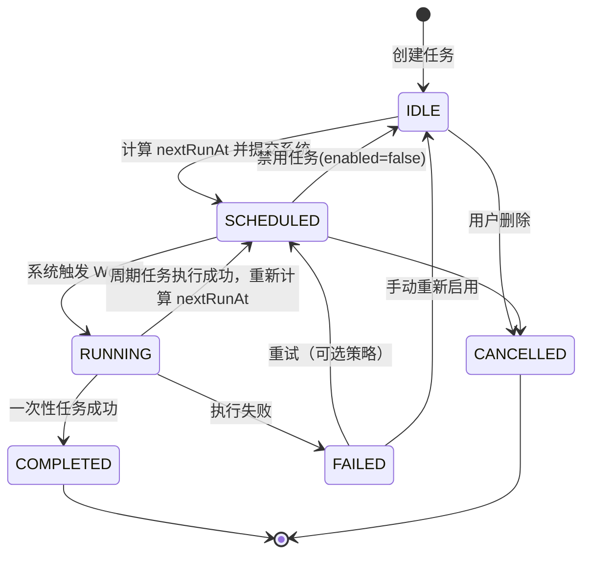

# builtin/scheduler — 定时任务模块规划（终版）

> 参考 AstrBot `CronJobManager` + Android 原生调度能力设计
> 根据 cli_aab3 评审意见修订，四点确认后定稿

---

## 一、背景与目标

Phase 2 定时任务/提醒模块，使兰心 Android 具备：

- 创建和管理定时任务（周期性 / 一次性）
- 到时间 **自动执行**（无需用户手动触发）
- 两种任务类型：BASIC（注册回调）和 ACTIVE_AGENT（唤醒 LLM 对话）

### 与 AstrBot 的差异

| AstrBot | 兰心 Android |
|---------|-------------|
| APScheduler 进程内调度 | **WorkManager OneTimeWorkRequest + AlarmManager 双轨调度** |
| CronMessageEvent 推送到平台 | **通知栏提醒 + Deep Link 唤起 ChatActivity** |
| 单进程常驻 | Worker 短暂运行后退出，省电不常驻 |

---

## 二、领域模型

```kotlin
enum class SchedulerTaskType { BASIC, ACTIVE_AGENT }

enum class TaskStatus {
    IDLE,       // 尚未调度
    SCHEDULED,  // 已交付系统（nextRunAt 有效）
    RUNNING,    // 正在执行
    COMPLETED,  // 一次性任务成功结束
    FAILED,     // 执行失败（可重试）
    CANCELLED   // 用户取消
}

data class SchedulerTask(
    val id: String = UUID.randomUUID().toString(),
    val name: String,
    val type: SchedulerTaskType,
    val cronExpression: String?,                  // 非空为周期任务
    val runOnce: Boolean,                         // 是否一次性（runAt 非空）
    val runAt: Long?,                             // 一次性执行时间 (epoch ms)
    val timezone: ZoneId = ZoneId.systemDefault(),
    val payload: Map<String, String>,             // BASIC 必须含 action 字段
    val enabled: Boolean = true,
    val autoStartConversation: Boolean = true,    // ACTIVE_AGENT 通知点击是否自动对话
    val nextRunAt: Long? = null,                  // 系统调度依据
    val lastRunAt: Long? = null,
    val lastError: String? = null,
    val status: TaskStatus = TaskStatus.IDLE,
    val createdAt: Long = System.currentTimeMillis()
)

// BASIC 任务 Action 注册接口
interface TaskActionHandler {
    suspend fun execute(context: Context, payload: Map<String, String>): Result<Unit>
}
```

---

## 三、任务状态流转图



---

## 四、存储 — Room

```kotlin
@Entity(tableName = "scheduler_tasks")
data class SchedulerTaskEntity(
    @PrimaryKey val id: String,
    val name: String,
    val type: String,              // "BASIC" / "ACTIVE_AGENT"
    val cronExpression: String?,
    val runOnce: Boolean,
    val runAt: Long?,
    val timezone: String,
    val payload: String,           // JSON
    val enabled: Boolean,
    val autoStartConversation: Boolean,  // 默认 true
    val nextRunAt: Long?,
    val lastRunAt: Long?,
    val lastError: String?,
    val status: String,            // TaskStatus.name
    val createdAt: Long
)
```

DAO 提供：`getEnabledTasks()`, `updateNextRunAndStatus()`, 等基础操作。

---

## 五、Cron 解析器（标准 5 字段 + 星期英文简写）

```kotlin
class CrontabParser {
    data class CronSchedule(
        val minutes: List<Int>, val hours: List<Int>,
        val daysOfMonth: List<Int>, val months: List<Int>,
        val daysOfWeek: List<Int>
    )

    fun parse(expression: String): CronSchedule

    // 计算从 baseTime 之后的下一次执行时间
    fun nextExecutionTime(
        baseTime: ZonedDateTime, schedule: CronSchedule
    ): ZonedDateTime

    // 将 cron 表达式转为人类可读文本
    fun toHumanReadable(expression: String): String
}
```

内部使用 `ZonedDateTime` 处理时区。

---

## 六、调度引擎核心 — SchedulerEngine

### 核心策略

```
对每个 SCHEDULED 状态的任务：
  1. 获取 nextRunAt，或通过 CrontabParser / runAt 计算
  2. 计算 delayMs = nextRunAt - now()

  ┌──────────────────────────────────────────────────────────┐
  │  delayMs ≥ 15 分钟                                       │
  │  → OneTimeWorkRequest                                    │
  │    setInitialDelay(delayMs) + setExpedited()             │
  │    保存 WorkRequest.id → taskId 映射（用于取消）          │
  ├──────────────────────────────────────────────────────────┤
  │  0 < delayMs < 15 分钟                                   │
  │  → AlarmManager.setExactAndAllowWhileIdle()              │
  │    PendingIntent → AlarmReceiver                         │
  │    Receiver 中 enqueue 0-delay 的 OneTimeWorkRequest     │
  │    保存 PendingIntent → taskId 映射（用于取消）           │
  ├──────────────────────────────────────────────────────────┤
  │  delayMs ≤ 0（已过期）                                    │
  │  → 立即 enqueue 0-delay 的 OneTimeWorkRequest            │
  └──────────────────────────────────────────────────────────┘
```

### 确认决定

- **精度：分钟级** ✅ — 定时提醒、周期性任务以分钟为最小粒度完全满足需求，无需秒级
- 若未来有极低概率的秒级需求，可通过 `AlarmManager.setAlarmClock()` + 短暂前台 Service 扩展，不破坏现有架构

### 取消 / 更新

修改或删除任务时，通过映射找到对应 `WorkRequest.id` 或 `PendingIntent` 并取消，然后重新计算调度。

### Worker 执行后处理

```
任务执行完毕：
  ├── cronExpression != null（周期任务）
  │   → 重新计算下次 nextRunAt
  │   → 更新 DB（updateNextRunAndStatus → SCHEDULED）
  │   → 调用 SchedulerEngine.scheduleTask() 安排下一次
  └── cronExpression == null（一次性）
      → 标记 COMPLETED，结束
```

---

## 七、Worker 实现

```kotlin
@HiltWorker
class SchedulerTaskWorker @AssistedInject constructor(
    @Assisted context: Context,
    @Assisted params: WorkerParameters,
    private val repository: SchedulerRepository,
    private val actionRegistry: TaskActionRegistry
) : CoroutineWorker(context, params) {

    override suspend fun doWork(): Result {
        val taskId = inputData.getString("task_id") ?: return Result.failure()
        val task = repository.getTask(taskId) ?: return Result.failure()
        repository.updateStatus(taskId, TaskStatus.RUNNING)

        val result = try {
            when (task.type) {
                SchedulerTaskType.BASIC -> executeBasic(task)
                SchedulerTaskType.ACTIVE_AGENT -> executeActiveAgent(task)
            }
        } catch (e: Exception) {
            repository.updateLastError(taskId, e.message)
            return Result.retry()
        }

        // 执行后处理
        if (task.cronExpression != null) {
            val next = CrontabParser()
                .nextExecutionTime(ZonedDateTime.now(task.timezone), ...)
                .toInstant().toEpochMilli()
            repository.updateNextRunAndStatus(taskId, next, TaskStatus.SCHEDULED)
            SchedulerEngine.scheduleTask(taskId)
        } else {
            repository.updateStatus(taskId, TaskStatus.COMPLETED)
        }
        return result
    }

    private suspend fun executeBasic(task: SchedulerTask): Result {
        val action = task.payload["action"] ?: return Result.failure()
        val handler = actionRegistry.getHandler(action) ?: return Result.failure()
        return if (handler.execute(applicationContext, task.payload).isSuccess)
            Result.success() else Result.failure()
    }

    private suspend fun executeActiveAgent(task: SchedulerTask): Result {
        val title = task.payload["notificationTitle"] ?: "定时提醒"
        val content = task.payload["notificationContent"] ?: ""

        val intent = Intent(applicationContext, MainActivity::class.java).apply {
            putExtra("task_id", task.id)
            putExtra("prompt", content)
            putExtra("auto_start", task.autoStartConversation)  // 控制是否自动发送
            flags = Intent.FLAG_ACTIVITY_NEW_TASK or Intent.FLAG_ACTIVITY_CLEAR_TOP
        }
        val pendingIntent = PendingIntent.getActivity(
            applicationContext, task.id.hashCode(), intent,
            PendingIntent.FLAG_UPDATE_CURRENT or PendingIntent.FLAG_IMMUTABLE
        )

        val notification = NotificationCompat.Builder(applicationContext, CHANNEL_ID)
            .setContentTitle(title)
            .setContentText(content)
            .setSmallIcon(R.drawable.ic_notification)
            .setAutoCancel(true)
            .setContentIntent(pendingIntent)
            // 两个快捷操作按钮
            .addAction(R.drawable.ic_send, "立即对话", pendingIntent)
            .addAction(R.drawable.ic_view, "仅查看", viewOnlyIntent)
            .build()

        NotificationManagerCompat.from(applicationContext)
            .notify(task.id.hashCode(), notification)
        return Result.success()
    }
}
```

### ACTIVE_AGENT 通知点击行为确认

| 开关 | 行为 |
|------|------|
| `autoStartConversation = true`（默认） | 点击通知 → Deep Link → ChatActivity 收到 prompt 后**自动调用** `ChatViewModel.sendMessage(prompt)` |
| `autoStartConversation = false` | 点击通知 → 打开 ChatActivity，**输入框预填 prompt**，等待用户确认发送 |

通知栏提供两个快捷操作按钮：「立即对话」和「仅查看」，即使用户不打开应用也能快速选择。

---

## 八、AlarmReceiver（精确闹钟兜底）

```kotlin
class AlarmReceiver : BroadcastReceiver() {
    override fun onReceive(context: Context, intent: Intent) {
        val taskId = intent.getStringExtra("task_id") ?: return
        val workRequest = OneTimeWorkRequestBuilder<SchedulerTaskWorker>()
            .setInputData(workDataOf("task_id" to taskId))
            .setExpedited(OutOfQuotaPolicy.RUN_AS_NON_EXPEDITED_WORK_REQUEST)
            .build()
        WorkManager.getInstance(context).enqueue(workRequest)
    }
}
```

---

## 九、TaskActionRegistry（BASIC 回调注册表）

```kotlin
class TaskActionRegistry {
    private val handlers = ConcurrentHashMap<String, TaskActionHandler>()

    fun register(action: String, handler: TaskActionHandler)
    fun unregister(action: String)
    fun getHandler(action: String): TaskActionHandler?
    fun listActions(): List<String>  // 供 UI 选择器使用
}
```

### 第一批内置 action

| action | 功能 | 说明 |
|--------|------|------|
| `http_request` | 发送 HTTP 请求 | url、method、headers、body 从 payload 取 |
| `app_broadcast` | 发送应用内广播 | 其他模块通过 BroadcastReceiver 监听，解耦 |
| `log_event` | 记录事件到本地日志 | 便于调试和审计 |
| `toast_notify` | 前台 Toast 提示 | 简单本地通知（不需通知权限）|

> **不内置** `shell_exec` 等高风险操作，避免被恶意 MCP 调用。后续扩展由外部插件自行注册安全的 action。

---

## 十、MCP 工具

| 工具名 | 说明 |
|--------|------|
| `task_create` | 校验 cron，校验 BASIC action 已注册，保存、计算 nextRunAt、调度 |
| `task_list` | 列表，可按 type / status 过滤 |
| `task_update` | 更新字段，取消旧调度，重新计算并调度 |
| `task_delete` | 删除记录 + 取消调度 |
| `task_run_now` | 立即 enqueue 0-delay Worker，不改变调度状态 |
| `task_pause` | enabled=false，取消调度，置 IDLE |
| `task_resume` | enabled=true，计算 nextRunAt，重新调度 |

---

## 十一、权限与兼容性

| 权限 | 版本 | 说明 |
|------|------|------|
| `POST_NOTIFICATIONS` | Android 13+ | ACTIVE_AGENT 通知需要，首次使用动态请求 |
| `SCHEDULE_EXACT_ALARM` | Android 12+ | AlarmManager 精确闹钟需要，设置页引导 |
| 电池优化白名单 | 所有版本 | 可选引导，确保 WorkManager 不被 Doze 过度延迟 |

对所有 `OneTimeWorkRequest` 使用 `setExpedited()`；`AlarmManager` 使用 `setExactAndAllowWhileIdle()` 穿透 Doze。

---

## 十二、UI

### 页面

| 页面 | 说明 |
|------|------|
| 设置页入口 | 「定时任务」菜单项 |
| `TaskListScreen` | 列表：名称、cron / "一次性"、下次执行时间、开关（enabled） |
| `TaskEditScreen` | 新建/编辑（见下方详情） |
| 权限引导 | 通知权限、精确闹钟、电池优化，缺失时弹窗引导 |

### TaskEditScreen 详情

**cron 输入方式（确认方案）：预设选择器 + 自由输入框**

1. 预设列表：每天 HH:mm、每周一/三/五 HH:mm、每月 1 日 HH:mm、每小时 → 选中后自动生成标准 cron 填入输入框
2. 自由输入框：展示当前 cron 表达式，实时高亮错误
3. 人类可读预览：CrontabParser.toHumanReadable() 显示如"每周一至周五 09:00"
4. 快捷测试按钮：计算并展示"下一次执行时间"

**类型相关字段：**

| 字段 | BASIC | ACTIVE_AGENT |
|------|-------|-------------|
| action 选择器 | ✅ 列出已注册 action | ❌ |
| 通知标题 | ❌ | ✅ |
| 通知内容 | ❌ | ✅ |
| autoStartConversation 开关 | ❌ | ✅ 默认开启 |

---

## 十三、文件结构

```
builtin/scheduler/
├── SchedulerPlugin.kt          // 插件入口，负责初始化
├── data/
│   ├── SchedulerTaskEntity.kt
│   ├── SchedulerDao.kt
│   └── SchedulerDatabase.kt
├── domain/
│   ├── SchedulerModels.kt       // SchedulerTask, TaskStatus, TaskActionHandler
│   ├── CrontabParser.kt
│   ├── SchedulerRepository.kt   // 封装 DAO + 线程调度
│   └── SchedulerEngine.kt       // 核心调度器（计算、提交、取消）
├── di/
│   └── SchedulerModule.kt       // Hilt 提供 repository, engine, worker 等
├── worker/
│   ├── SchedulerTaskWorker.kt
│   └── AlarmReceiver.kt
├── registry/
│   └── TaskActionRegistry.kt    // action → handler 注册表
├── presentation/
│   ├── TaskListScreen.kt
│   ├── TaskListViewModel.kt
│   ├── TaskEditScreen.kt
│   └── TaskEditViewModel.kt
└── README.md
```

---

## 十四、实施顺序

```
Phase 2 — builtin/scheduler
├── ① 数据层（Room Entity + Dao + Database）
├── ② 领域模型 + Cron 解析器
├── ③ SchedulerEngine（含 WorkManager / AlarmManager 调度）
├── ④ Worker + AlarmReceiver
├── ⑤ TaskActionRegistry + 示例 handler
├── ⑥ DI 整合（Hilt Module）
├── ⑦ MCP 工具
└── ⑧ UI（权限引导一并完成）
```

---

## 附录：四点确认汇总

| # | 问题 | 结论 |
|---|------|------|
| 1 | cron 精度 | **分钟级**，WorkManager(≥15min) + AlarmManager(<15min) 双轨够用 |
| 2 | 通知点击行为 | 默认**自动发起对话**（选项 A），UI 可配置 `autoStartConversation` 开关 |
| 3 | BASIC 初始 action | `http_request` / `app_broadcast` / `log_event` / `toast_notify`，不内置高风险操作 |
| 4 | cron 输入方式 | **预设选择器 + 自由输入框**，实时预览 + 测试下次执行时间 |
